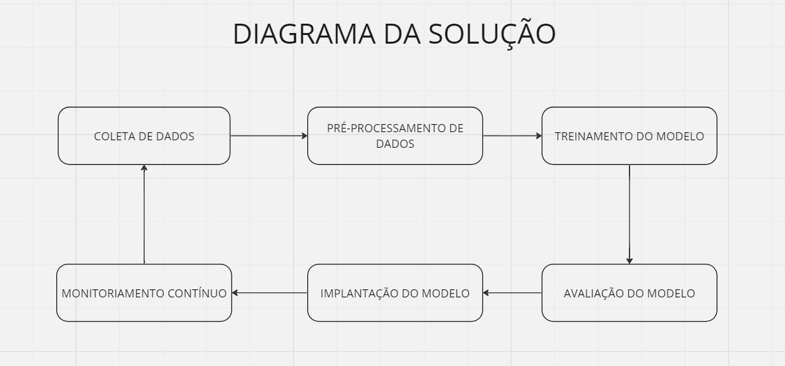

# Proposta de Fomento ao Aprendizado Contínuo em Sistemas Conversacionais

## Introdução

Os sistemas conversacionais, como chatbots e assistentes virtuais, são amplamente utilizados em diversos setores, desde atendimento ao cliente até assistência pessoal. No entanto, um desafio significativo enfrentado por esses sistemas é a falta de atualização contínua dos modelos de linguagem, o que pode resultar em respostas desatualizadas ou imprecisas para os usuários.

Um dos principais problemas associados à falta de atualização é o conceito de *concept drift*, que se refere à mudança gradual nas distribuições de dados ao longo do tempo. Isso significa que as relações entre as entradas e saídas do sistema podem se modificar, tornando os modelos de linguagem obsoletos ou menos eficazes.

## Solução Proposta

Para fomentar o aprendizado contínuo em sistemas conversacionais e lidar com o problema do concept drift, propomos a seguinte abordagem:

### Diagrama de Blocos

### Descrição dos Blocos

1. **Coleta de Dados**:
   - Responsável por coletar dados de interações do usuário com o sistema conversacional, incluindo mensagens de entrada e saída.

2. **Pré-processamento de Dados**:
   - Realiza a limpeza e normalização dos dados coletados, removendo ruídos e preparando-os para a etapa de treinamento do modelo.

3. **Treinamento do Modelo**:
   - Utiliza os dados pré-processados para atualizar periodicamente o modelo de linguagem do sistema conversacional, incorporando novos padrões e relações.

4. **Avaliação do Modelo**:
   - Avalia regularmente o desempenho do modelo atualizado em um conjunto de dados de validação, identificando possíveis áreas de melhoria ou degradação.

5. **Implantação do Modelo**:
   - Após a validação bem-sucedida, o modelo atualizado é implantado no sistema conversacional para substituir o modelo anterior.

6. **Monitoramento Contínuo**:
   - Monitora constantemente o desempenho do sistema em tempo real, identificando sinais de concept drift e indicando a necessidade de reativação do ciclo de atualização.

## Conclusão

A proposta apresentada visa abordar o desafio da falta de atualização em sistemas conversacionais, adotando uma abordagem de aprendizado contínuo. Embora exija esforço inicial significativo para implementação, acreditamos que os benefícios de oferecer respostas precisas e atualizadas aos usuários superam os desafios técnicos e operacionais.

## Referências Bibliográficas

1. Gama, J., Sebastião, R., & Rodrigues, P. (2009). "Issues in evaluation of stream learning algorithms." In Proceedings of the 15th ACM SIGKDD International Conference on Knowledge Discovery and Data Mining (pp. 329-338).
2. Tsymbal, A. (2004). "The problem of concept drift: definitions and related work." Computer Science Department, Trinity College Dublin, Ireland.
